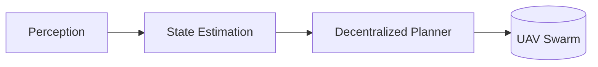

---
# ============================================================
# Demo Project — a VISIBLE example so the Projects page renders
# out of the box. Copy this file, rename it (e.g. my-project.md),
# replace the fields below, then delete this demo once you have
# real projects.
# ============================================================

# title [Required]: Project name. Shown on the card + detail page.
title: Autonomous Drone Swarm Coordination

# description [Optional]: One-line summary shown on the project card.
description: Decentralized control algorithms for coordinating a swarm of UAVs in cluttered environments.

# status [Optional]: Recruitment badge on the card. One of:
#   open       — open to applicants, no funding   → yellow badge
#   ongoing    — recruiting, funded               → blue, pulsing badge
#   completed  — finished, no longer recruiting   → green badge
#   maintained — under long-term maintenance      → purple badge
status: ongoing

# year [Optional]: Displayed on the card and used for ordering.
year: 2025

# image [Optional]: Cover image. Either co-locate it next to this
# markdown (e.g. `assets/cover.webp`) and reference it relatively, or
# use an absolute path like `/images/cover.webp`. ~1200×800, WebP preferred.
image: /images/logo.png

# funded [Optional]: When true, a "Funded" badge is shown on the card.
funded: true
---

## Overview

This is a **demo project** so the Projects page renders out of the box. Replace it with your real projects — one Markdown file per project. All Markdown features are supported: headings, lists, tables, images, code blocks, and diagrams.

### Key Contributions

- A fully decentralized planner with provable collision avoidance.
- An open-source simulation toolkit used by several partner labs.

### Pipeline

Markuxt renders Mermaid diagrams natively (configured in the layer's `nuxt.config.ts`):

### Funding

Supported by the National Example Foundation, Grant #EX-2025.

### Contact

For collaboration enquiries, contact [pi@your-lab.edu](mailto:pi@your-lab.edu).
